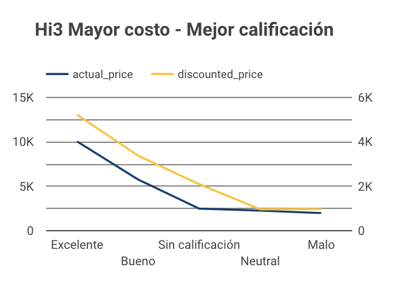
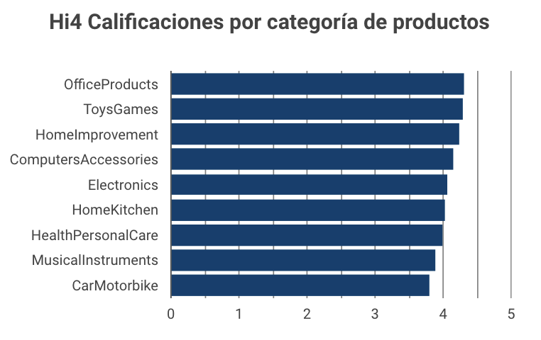
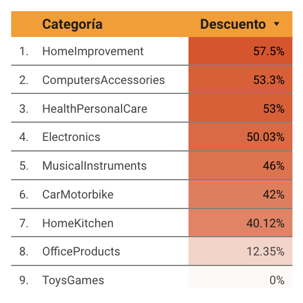
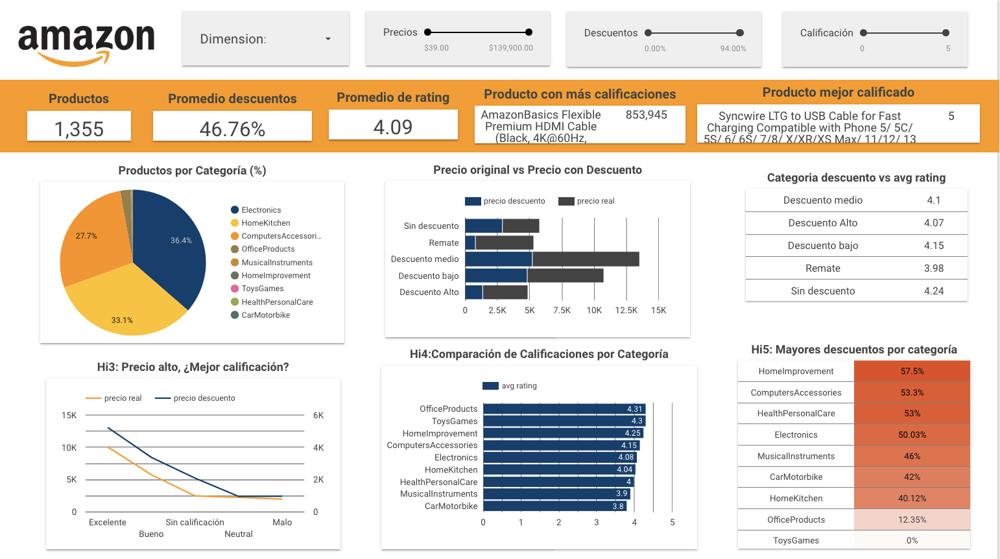

# Proyecto: Amazon_reviews

## Indice:
1. [Objetivo](#Objetivo)
2. [Contexto](#Contexto)
3. [Metodología](#Metodología)   
    3.1. [Procesamiento y preparación de datos](#Procesamiento-y-preparación-de-datos)   
    3.2. [Análisis de hipótesis](#Análisis-de-hipótesis)   
    3.3. [Creación de Dashboard en Looker Studio](#Creación-de-Dashboard-en-Looker-Studio) 
4. [Resultados y Recomendaciones](#Resultados-y-Recomendaciones)
5. [Enlaces de recursos adicionales](#Enlaces-de-recursos-adicionales)  
   
## 1. Objetivo:

Analizar los datos de productos de Amazon (precios, descuentos, calificaciones, número de reseñas y categorías) para identificar patrones y relaciones clave que ayuden a comprender el comportamiento de los productos en función de sus precios y descuentos.

## 2. Contexto: 

Datalab, una empresa líder en análisis de datos, se ha posicionado como un aliado confiable para compañías de diversos sectores gracias a su enfoque único de consultoría. En este proyecto, centrado en las ventas y reseñas de Amazon, se analizan datos de más de 1,000 productos disponibles en la plataforma. Amazon, como gigante del comercio electrónico, ofrece un proceso integral de ventas, desde la fijación de precios hasta la gestión de inventario y servicio al cliente. Este análisis busca aprovechar las habilidades analíticas para explorar cómo los precios, descuentos y calificaciones impactan el rendimiento de los productos en Amazon.

Además, con la información encontrada se espera poder dar respuesta a las siguientes hipótesis propuestas (basados en datos numéricos y categóricos):

- Hi1:"Cuanto mayor sea el descuento, mejor será la calificación del producto(puntuación)."  
SQL: correlación o comparación de promedios agrupados por rangos de descuento.

- Hi2: "Cuanto mayor sea el número de personas que evaluaron el producto (rating count), mejor será la calificación (promedio)."   
SQL: cálculo de  promedios ponderados o agrupaciones de productos por el número de reseñas y su calificación promedio.

- Hi3: "Los productos más caros tienen a recibir calificaciones más altas."   
SQL: analisis de la relación entre actual_price o discounted_price y la calificación promedio.

- Hi4: "Algunas categorías de productos tienden a recibir mejores calificaciones que otras."   
SQL: agrupación de productos por categoría y cálculo de la calificación promedio para cada una.

- Hi5: "Los productos con los mayores descuentos pertenecen a categorías específicas."    
SQL: agrupación de productos por categoría y cálculo de los descuentos promedio.

## 3. Metodología

### 3.1. Procesamiento y preparación de datos:

#### a. Herramientas:
* Google Sheets
* BigQuery
* Looker Studio 
* Canva
* Loom

#### b. Lenguajes:
* SQL en BigQuery

#### c. Descripción de las fuentes de datos:

Este conjunto de datos provienen de un repositorio de Kaggle.

**Tabla amazon_product**
- *product_id*: ID del producto
- *product_name*: Nombre del producto
- *category*: Categoría del producto
- *discounted_price*: Precio con descuento del producto
- *actual_price*: Precio real del producto
- *discount_percentage*: porcentaje de descuento del producto
- *about_product*: Descripción sobre el producto

**Tabla amazon_review**
- *user_id*: ID del usuario que escribió la reseña del Producto
- *user_name*: nombre del usuario que escribió la reseña del Producto
- *Review_id*: ID de la reseña del usuario
- *Review_title*: Breve reseña
- *Review_content*: reseña larga
- *Img_link*: Enlace de imagen del producto
- *Product_link*: Enlace al sitio web oficial del producto
- *Product_id*: ID del producto
- *Rating*: Calificación del Producto
- *Rating_count*: número de personas que votaron por la calificación de Amazon


#### c. Limpieza y transformación de datos:

- Datos iniciales: 
    * La tabla *products* contiene 1,469 registros y la tabla *reviews* contiene 1,465 registros.
    * La clave de búsqueda utilizada para la unión es *product_id*.

- Revisión de calidad de datos:
    * En la tabla *reviews*, se encontraron 92 productos duplicados, lo que indica múltiples reseñas por *product_id*.
    * En la tabla *products*, se encontraron 96 productos duplicados, lo cual es problemático ya que cada *product_id* debería ser único, podrían afectar las uniones, causando más filas de las esperadas y posibles inconsistencias en los datos.

- Resolución de duplicados:
    * Se eliminaron los duplicados en la tabla *products* y *reviews* utilizando la función `DISTINCT` para garantizar un solo registro por *product_id*.
    * Tras eliminar los duplicados, se redujo la tabla *products* a 1,363 registros únicos. 
    * Se actualizó la variable *discount_percentage*, encontrando 89 tipos de descuentos.
    * No se encontraron caracteres especiales en las variables evaluadas.

- Normalización de datos:
    * Se realizaron conversiones de datos, como la transformación de valores a porcentajes y la actualización de categorías para *discounte_percentage* y *rating*
    * La variable *category* se normalizó, identificando 136 tipos de categorías únicas, las que cuales se dividieron 6 seis niveles, utilizando unicamente 3 de estos para el analisis siguiente.
    
##### Query limpieza de duplicados y creación de nuevas variables en tabla products

``` sql
SELECT DISTINCT 
  product_id, 
  product_name, 
  discounted_price, 
  actual_price, 
  (actual_price - discounted_price) AS discount_currency,  
  discount_percentage, 
  category,
  CASE
    WHEN discount_percentage = 0 THEN 'Sin descuento'
    WHEN discount_percentage > 0 AND discount_percentage <= 0.25 THEN 'Descuento bajo'
    WHEN discount_percentage > 0.25 AND discount_percentage <= 0.50 THEN 'Descuento medio'
    WHEN discount_percentage > 0.50 AND discount_percentage <= 0.75 THEN 'Descuento Alto'
    ELSE 'Remate'
  END AS discount_category
FROM 
  `project4-amazon-reviews.amazon_reviews.products`
WHERE product_id IS NOT NULL;
``` 

- Vistas y creación de tablas auxiliares:
    * Se crearon tablas auxiliares sin duplicados y con conversiones adecuadas en los datos de ambas tablas.
    * Se crearon las vistas *product_category*, *product_ready* y *reviews_ready*.

- Unión Final de las Tablas:
    * Se realizó la unión de las tres vistas, utilizando `LEFT JOIN`, resultando en 1,355 registros válidos.
    
##### Query unión de tablas vista

``` sql    
SELECT DISTINCT
  p.product_id,
  p.actual_price,
  p.discounted_price,
  p.discount_category,
  p.discount_percentage,
  p.discount_currency,
  p.category,
  p.product_name,
  c.cat_1,
  c.cat_2,
  c.cat_3,
  c.clean_proname,
  r.average_rating,
  r.total_ratings,
  r.review_title,
  r.categoria_rating,
FROM
  `project4-amazon-reviews.amazon_reviews.product_ready` AS p
LEFT JOIN
  `project4-amazon-reviews.amazon_reviews.product_category` AS c
ON 
  p.product_id = c.product_id  
LEFT JOIN
  `project4-amazon-reviews.amazon_reviews.reviews_ready` AS r
ON 
  p.product_id = r.product_id
```

### 3.2. Análisis de hipótesis:

Para comprobar las cinco hipótesis planteadas, se utilizaron consultas SQL y visualizaciones en Looker Studio. A continuación, se detallan los hallazgos de cada hipótesis:

- Hi1: "Cuanto mayor sea el descuento, mejor será la calificación del producto."
    * Resultado: No se encontró una relación clara. Los gráficos de dispersión mostraron una falta de patrón consistente, lo que indica que los descuentos no influyen significativamente en las calificaciones.
    * Conclusión: La hipótesis fue refutada, ya que los clientes no califican mejor los productos simplemente por tener mayores descuentos.   
    
    ##### Query  de correlacón Hi1
    
    ``` sql 
    SELECT 
        CORR(discount_percentage,average_rating) FROM `project4-amazon-reviews.amazon_reviews.main_dataset` -0.1623938108687
    ```

- Hi2: "Cuanto mayor sea el número de evaluaciones (rating count), mejor será la calificación promedio."
    * Resultado: La relación fue muy débil. Los productos con un gran número de reseñas no mostraron una tendencia a obtener calificaciones más altas. Las calificaciones tendieron a estabilizarse alrededor de un promedio, independientemente del número de evaluaciones.
    * Conclusión: La hipótesis fue refutada. La popularidad de un producto no se traduce necesariamente en una mejor calificación promedio.   
    
    ##### Query  de correlación Hi2
    
    ``` sql 
    SELECT 
        CORR(total_ratings, average_rating) FROM `project4-amazon-reviews.amazon_reviews.main_dataset`- 0.100244380882
    ```

- Hi3: "Los productos más caros tienden a recibir calificaciones más altas."
    * Resultado: Hubo una evidencia moderada que respalda la hipótesis. Los productos con precios más altos, tanto originales como con descuento, tienden a recibir calificaciones más altas. Sin embargo, la correlación no fue lo suficientemente fuerte para ser concluyente.
    * Conclusión: La hipótesis fue parcialmente respaldada. Los consumidores parecen asociar un precio más alto con mayor calidad, pero no es un factor decisivo en todas las calificaciones.    
    
    ##### Gráfica de línea Hi3
    
    

- Hi4: "Algunas categorías de productos tienden a recibir mejores calificaciones que otras."
    * Resultado: Ciertas categorías, como "OfficeProducts" y "ToysGames," tienden a recibir calificaciones ligeramente más altas. Sin embargo, las diferencias no fueron extremas, con la mayoría de las categorías manteniendo calificaciones en torno a un valor promedio.
    * Conclusión: La hipótesis fue parcialmente respaldada. Aunque hay diferencias entre las categorías, estas no son significativas en la mayoría de los casos.   
    
    ##### Gráfica de barras Hi4
    
    
    
- Hi5: "Los productos con los mayores descuentos pertenecen a categorías específicas."
    * Resultado: Esta hipótesis fue plenamente respaldada. Las categorías como "HomeImprovement," "ComputersAccessories," y "HealthPersonalCare" tuvieron los mayores descuentos promedio, superando el 50%.
    * Conclusión: La hipótesis fue confirmada. Los descuentos más altos están claramente asociados con categorías específicas.
    
     ##### Mapa de calor Hi5
    
    


### 3.3. Creación de Dashboard en Looker Studio:

Este dashboard incluye los siguientes elementos clave:

- Botón de Dimensiones: Permite cambiar las dimensiones a categorías o rangos de descuento, para una exploración más profunda de los datos.   

- Filtros Interactivos: Permiten segmentar los datos por categoría de producto, rango de precios, rango de descuento, calificaciones (1 a 5 estrellas) y número de reseñas, facilitando la exploración personalizada de los datos.   

- Scorecards (KPI): Muestran métricas clave como el número total de productos analizados, el promedio de calificación, el promedio de descuento aplicado, el producto con mayor número de reseñas y el producto con mayor descuento.  

- Visualizaciones:
    * Gráficas de líneas, circular y de barras: Comparan calificaciones por categoría, distribución de descuentos y precios.
    * Tablas: Ofrecen detalles específicos de productos con mayores calificaciones, más reseñas y mayores descuentos.
    
     ##### Visualización de Dasboard
     
    

## 4. Resultados y recomendaciones

- Resultados:

    * La mayoría de las categorías de productos mantienen una calificación promedio cercana a 4, lo que indica una satisfacción general positiva entre los clientes.

    * Las hipótesis sobre la relación entre descuentos y calificaciones, así como el número de reseñas y la calidad percibida, no fueron respaldadas por los datos. 

    * Sin embargo, se encontró una tendencia donde los productos más caros suelen recibir calificaciones ligeramente más altas. Existe una percepción entre los consumidores de que los productos más caros son de mejor calidad, lo que se refleja en sus calificaciones.

    * Las categorías de productos muestran diferencias en el nivel de descuento promedio, lo que indica que los vendedores aplican estrategias de descuento más agresivas en estos segmentos para impulsar las ventas.

- Recomendaciones:

    * Analizar el tiempo de venta y el impacto de los descuentos: Obtener datos sobre el tiempo que tarda un producto en venderse desde su publicación permitiría identificar qué categorías o rangos de precios se venden más rápidamente, además, analizar cómo los descuentos influyen en el tiempo de venta podría evaluar la efectividad de las promociones y su impacto en la decisión de compra.

    * Para vendedores:  Enfocarse en la calidad del producto y en la experiencia del cliente. Esto mejora las calificaciones y refuerza la imagen de Amazon como una plataforma confiable, donde los clientes están dispuestos a pagar por productos de valor.

    * Para consumidores: Evaluar la calidad en función del precio y la categoría. Aunque los productos más caros suelen tener mejores calificaciones, no siempre es así. Los compradores deben equilibrar el precio, las reseñas y la categoría para tomar la mejor decisión.

## 5. Enlaces de recursos adicionales

- [Dashboard Looker Studio](https://lookerstudio.google.com/s/op9gu-h_MZw)
- [PPT Canva](https://www.canva.com/design/DAGQ_GP164E/Fzz61Fj53f4Z9KjFj7NHcw/edit)
- [Presentación Loom](https://www.loom.com/share/f52ff790d450463a96dfea79fa1110d6?sid=0706b987-111e-450d-9205-aee5439c158d)  

**Elaborado por:  
Natalia Alejandro González   
Dulce Carmona  
Septiembre 2024** 
